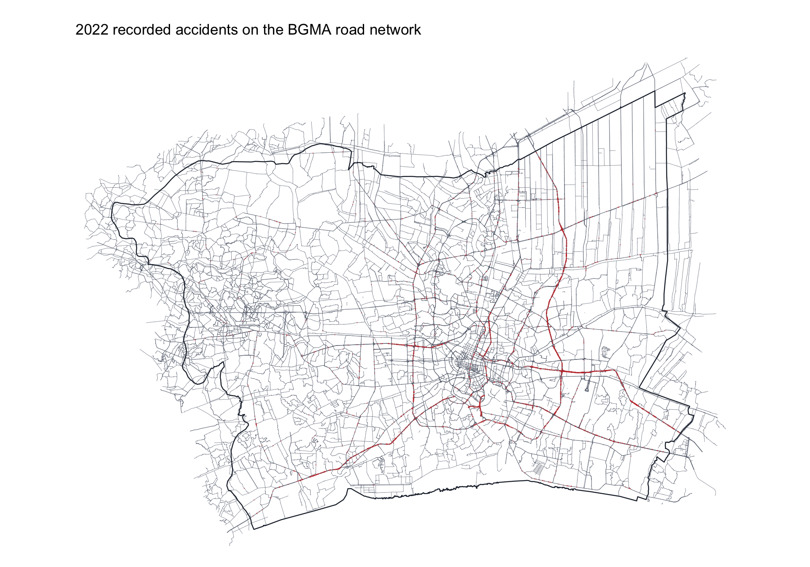
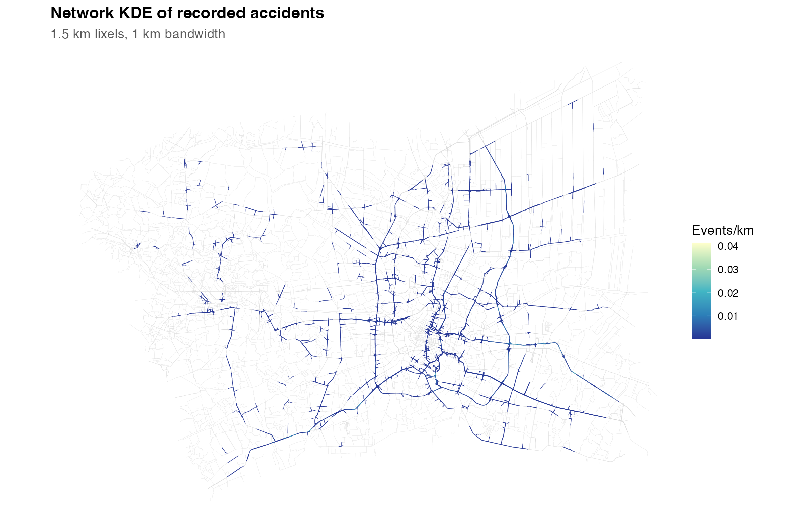
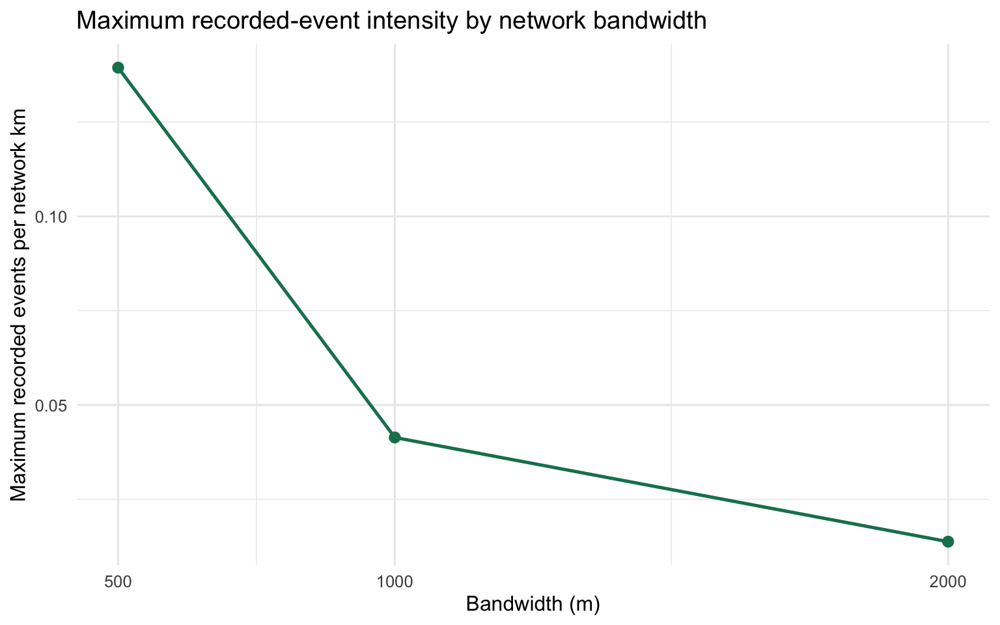
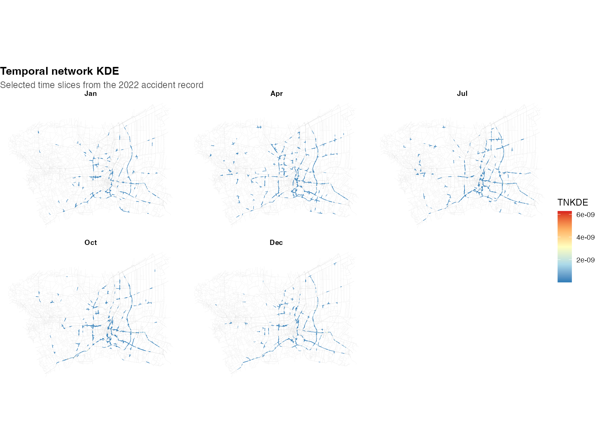
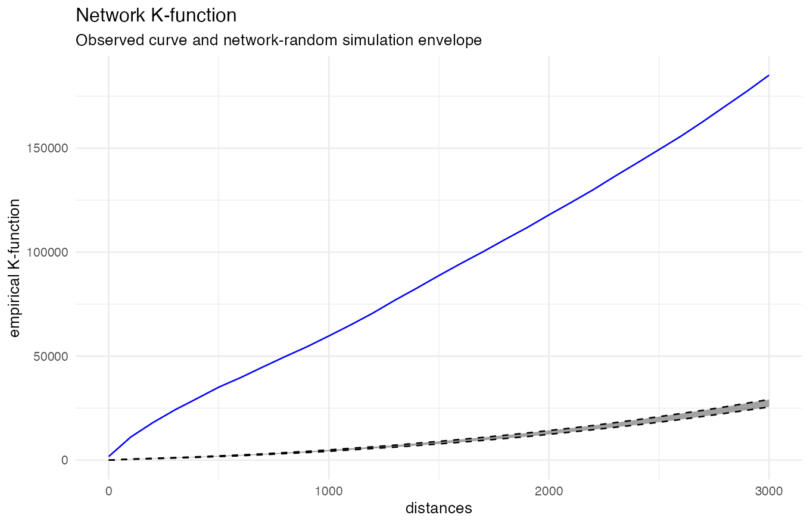
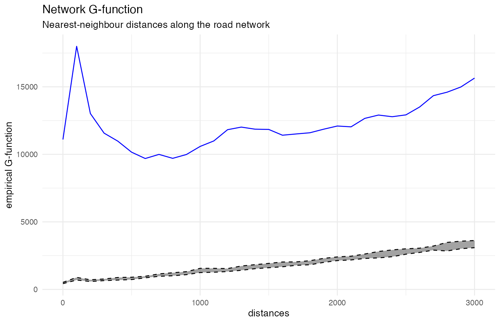
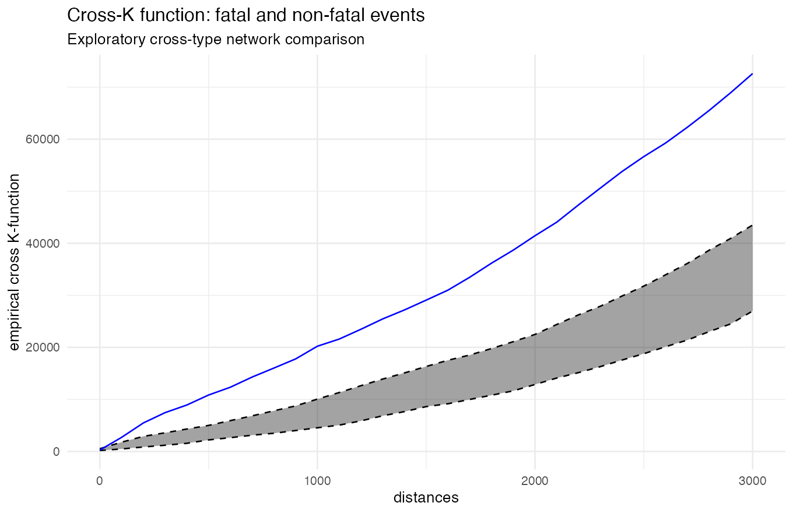
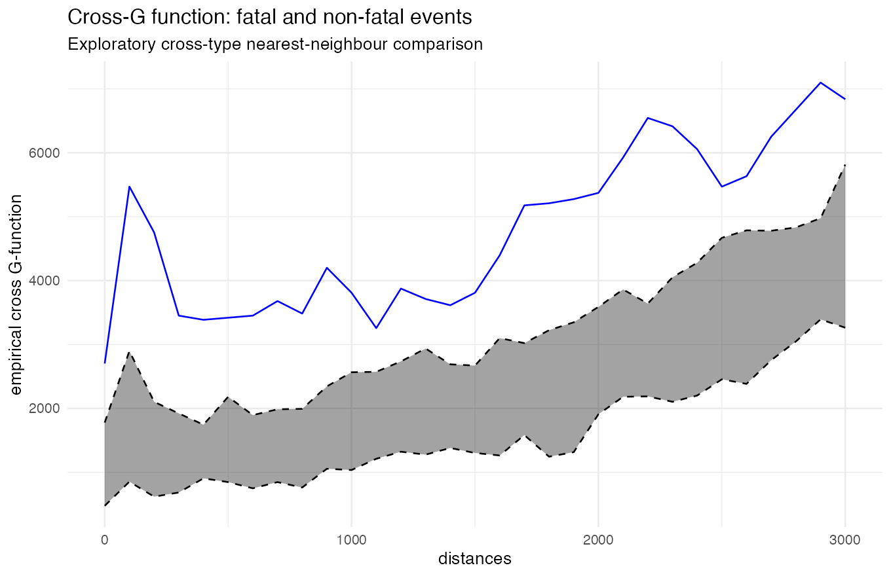

```{=html}
<style>
:root {
  --portfolio-green: #9fca24;
  --portfolio-deep: #17352a;
  --portfolio-ink: #24322d;
  --portfolio-muted: #61706a;
  --portfolio-line: #dbe7df;
  --portfolio-paper: #f6faf7;
}

.reveal {
  background: var(--portfolio-paper);
  color: var(--portfolio-ink);
  font-family: Inter, Avenir, Helvetica, Arial, sans-serif;
}

.reveal .slides {
  text-align: left;
}

.reveal .slides section {
  padding: 0.35em 0.6em;
}

.reveal .slides section h2 {
  color: var(--portfolio-deep);
  border-left: 0.18em solid var(--portfolio-green);
  padding-left: 0.35em;
  margin-top: 0.1em;
  margin-bottom: 0.4em;
  letter-spacing: 0;
}

.reveal .slides section h3 {
  color: var(--portfolio-deep);
}

.reveal .slides section p,
.reveal .slides section li,
.reveal .slides section td,
.reveal .slides section th {
  line-height: 1.35;
}

.reveal .slides section strong {
  color: var(--portfolio-deep);
}

.reveal .slides section img {
  display: block;
  width: 100%;
  border: 1px solid var(--portfolio-line);
  border-radius: 0.7rem;
  box-shadow: 0 0.35rem 1.2rem rgba(23, 53, 42, 0.09);
}

.reveal .slides .columns {
  display: flex;
  flex-wrap: nowrap;
  gap: 0.6rem;
  align-items: stretch;
  width: 100%;
}

.reveal .slides .columns > .column {
  flex: 1 1 0;
  width: auto !important;
  min-width: 0;
  background: #fff;
  border: 1px solid var(--portfolio-line);
  border-radius: 0.8rem;
  padding: 0.6rem 0.72rem 0.45rem;
  box-shadow: 0 0.3rem 1rem rgba(23, 53, 42, 0.06);
}

.reveal .slides .columns > .column p:last-child {
  color: var(--portfolio-muted);
  margin: 0.35rem 0 0;
  font-size: 0.58em;
  line-height: 1.22;
}

.reveal .slides .columns > .column figure {
  margin: 0;
}

.reveal .slides .columns > .column figcaption {
  margin-top: 0.2rem;
  color: var(--portfolio-deep);
  font-size: 0.52em;
  line-height: 1.1;
}

.reveal .slides .visual-grid > .column img {
  height: 13.8rem;
  max-height: 13.8rem;
  object-fit: contain;
}

.reveal .slides .interaction-grid > .column img,
.reveal .slides .value-grid > .column img {
  height: 19rem;
  max-height: 19rem;
  object-fit: contain;
}

.reveal .slides .study-grid {
  display: grid;
  grid-template-columns: minmax(0, 1.35fr) minmax(0, 1fr);
  gap: 0.6rem;
  align-items: center;
  margin-top: 0.2rem;
}

.reveal .slides .study-map,
.reveal .slides .study-copy {
  min-width: 0;
  padding: 0.65rem;
  border: 1px solid var(--portfolio-line);
  border-radius: 0.75rem;
  background: #fff;
  box-shadow: 0 0.3rem 1rem rgba(23, 53, 42, 0.06);
}

.reveal .slides .study-map img {
  height: 14.5rem;
  object-fit: contain;
}

.reveal .slides .region-label {
  margin-bottom: 0.45rem;
  color: var(--portfolio-deep);
  font-size: 0.78em;
  font-weight: 700;
  text-transform: uppercase;
  letter-spacing: 0.06em;
}

.reveal .slides .region-grid {
  display: grid;
  grid-template-columns: repeat(2, minmax(0, 1fr));
  gap: 0.42rem;
  margin-bottom: 0.7rem;
}

.reveal .slides .region-chip {
  display: block;
  padding: 0.46rem 0.52rem;
  border-left: 0.22rem solid var(--portfolio-green);
  border-radius: 0.3rem;
  background: #edf6d9;
  color: var(--portfolio-deep);
  font-size: 0.6em;
  font-weight: 650;
  line-height: 1.15;
}

.reveal .slides .study-copy p {
  margin: 0;
  color: var(--portfolio-muted);
  font-size: 0.61em;
  line-height: 1.3;
}

.reveal .slides table {
  border: 1px solid var(--portfolio-line);
  border-radius: 0.6rem;
  overflow: hidden;
  background: #fff;
}

.reveal .slides table thead {
  background: var(--portfolio-deep);
  color: #fff;
}

.reveal .slides table tr:nth-child(even) {
  background: #eef5ef;
}

.reveal .slides .kpi-row {
  display: flex;
  gap: 0.42rem;
  margin: 0.45rem 0 0.2rem;
}

.reveal .slides .kpi {
  flex: 1;
  min-height: 2.4rem;
  padding: 0.34rem 0.48rem;
  border-top: 0.18rem solid var(--portfolio-green);
  border-radius: 0.65rem;
  background: #fff;
  box-shadow: 0 0.3rem 1rem rgba(23, 53, 42, 0.07);
}

.reveal .slides .kpi-value {
  display: block;
  color: var(--portfolio-deep);
  font-size: 0.9em;
  font-weight: 750;
}

.reveal .slides .kpi-label {
  display: block;
  color: var(--portfolio-muted);
  font-size: 0.46em;
  text-transform: uppercase;
  letter-spacing: 0.04em;
  line-height: 1.1;
}

.reveal .slides section[data-background-color] h2 {
  border-left-color: var(--portfolio-green);
}

.reveal .title-slide h1,
.reveal .title-slide .subtitle,
.reveal .title-slide .quarto-title-author-name,
.reveal .title-slide .date {
  color: #fff;
  text-shadow: 0 0.12rem 0.35rem rgba(0, 0, 0, 0.35);
}

.reveal .title-slide h1 {
  font-size: 1.65em;
  border-left: 0.18em solid var(--portfolio-green);
  padding-left: 0.35em;
}

.reveal .footer {
  color: var(--portfolio-muted);
  font-size: 0.52em;
}

@media (max-width: 900px) {
  .reveal .slides .study-grid {
    grid-template-columns: 1fr;
  }

  .reveal .slides .visual-grid,
  .reveal .slides .interaction-grid,
  .reveal .slides .value-grid {
    flex-wrap: wrap;
  }

  .reveal .slides .kpi-row {
    gap: 0.45rem;
  }

  .reveal .slides .kpi {
    padding: 0.5rem;
  }
}
</style>
```

## Research question

Where and when were recorded road accidents concentrated along the Bangkok Greater Metropolitan Area road network in 2022?

The report asks four questions:

- Where is recorded accident intensity highest along roads?
- At what network distances are accidents closer together than expected?
- How do the strongest road segments change through the year?
- Are fatal and non-fatal events close to each other along the network?

The results describe recorded events. They are not exposure-adjusted crash-risk estimates.

## Study area and data

The study window is the six-province Bangkok Greater Metropolitan Area. The accident file is restricted to 2022. GeoBoundaries defines the administrative window, while the road support is a major-road extract derived from Geofabrik OpenStreetMap data.

```{=html}
<div class="study-grid">
  <div class="study-map">

  </div>
  <div class="study-copy">
    <div class="region-label">Study provinces</div>
    <div class="region-grid">
      <span class="region-chip">Bangkok</span>
      <span class="region-chip">Nonthaburi</span>
      <span class="region-chip">Pathum Thani</span>
      <span class="region-chip">Samut Prakan</span>
      <span class="region-chip">Samut Sakhon</span>
      <span class="region-chip">Nakhon Pathom</span>
    </div>
    <p>The map shows the geographic support used for the network analysis. It is not a population or traffic-exposure map.</p>
  </div>
</div>
```

::::::: kpi-row
::: kpi
[3,586]{.kpi-value}[located events]{.kpi-label}
:::

::: kpi
[39,480]{.kpi-value}[road features]{.kpi-label}
:::

::: kpi
[17,647 km]{.kpi-value}[network length]{.kpi-label}
:::

::: kpi
[2022]{.kpi-value}[study year]{.kpi-label}
:::
:::::::

## Data quality and network preparation

- 189 BGMA records have missing or invalid coordinates and are kept only for non-spatial counts.
- Duplicate accident IDs: 0.
- 321 rows share coordinates with another event. They remain separate because their accident IDs are different.
- Coordinates and roads are transformed to EPSG:32647 before matching and network analysis.
- The median point-to-road offset is about 3.97 m; the 95th percentile is about 10.8 m.
- The graph check found 5,187 connected components in the major-road extract. The results are limited to the available connected road support.

## Analytical workflow

The analysis follows the Chapter 7 network workflow:

1.  clean and project the event, boundary and road data;
2.  match recorded events to the road network;
3.  split roads into lixels and create line-centre samples;
4.  estimate discontinuous network KDE and compare bandwidths;
5.  use network K and G functions with a network-random reference;
6.  use TNKDE to compare network intensity across time;
7.  use cross-K and cross-G for fatal versus non-fatal events.

All distances are measured along the network. The main NKDE bandwidth is 1,000 m and the TNKDE time bandwidth is 30 days. The K/G and cross-K/G runs use nine simulations over 0--3,000 m, so these envelopes are exploratory.

## Key findings

- Recorded accident intensity is uneven across the road network. A small number of major-road corridors carry the highest estimated intensity.
- The NKDE bandwidth changes the height of the hotspot: about 0.139 events/km at 500 m, 0.041 at 1,000 m, and 0.014 at 2,000 m.
- K and G stay above the network-random envelope at the non-zero distances tested. G shows a short-distance peak and a second, wider rise.
- TNKDE shows that the strongest road segments change during the year. One annual map would hide this change.
- Fatal events are closer to non-fatal events than the simulated fatal layer under the selected network reference. This may reflect shared corridors or shared exposure; it is not a causal result.

## Visual evidence: intensity, scale and time

:::::: {.columns .visual-grid}
::: {.column width="33%"}
{width="100%"}

The NKDE map shows where recorded intensity is higher. Bright segments are places for further checking, not confirmed high-risk roads.
:::

::: {.column width="33%"}
{width="100%"}

The peak falls as the bandwidth gets wider. Hotspot height depends on the chosen scale.
:::

::: {.column width="34%"}
{width="100%"}

The TNKDE panels show that stronger segments move between time slices.
:::
::::::

## Visual evidence: network interaction

::::: {.columns .interaction-grid}
::: {.column width="50%"}
{width="100%"}

The K curve is above the envelope, showing more nearby events than the network-random reference.
:::

::: {.column width="50%"}
{width="100%"}

The G curve highlights local distance bands. The short-distance peak and later rise suggest two clustering scales.
:::
:::::

## Value-added result

::::: {.columns .value-grid}
::: {.column width="50%"}
{width="100%"}

The cross-K curve is above the envelope. Fatal events occur close to non-fatal events across the tested network distances.
:::

::: {.column width="50%"}
{width="100%"}

The cross-G curve describes nearest fatal--non-fatal distances. The smaller fatal group makes this result exploratory.
:::
:::::

## Public-safety implications

The results can support an initial screening process:

- review road segments that remain visible across more than one NKDE bandwidth;
- use TNKDE to match patrols or awareness work to the time periods where a corridor becomes stronger;
- include fatality counts when ranking corridors, rather than using event counts alone;
- check shortlisted locations against traffic volume, junction design, speed, lighting and emergency response time.

The maps do not estimate crash probability. They show where recorded events deserve closer transport-safety review.

## Limitations and reproducibility

The road layer is an OSM-derived major-road extract, not a complete official traffic network. Missing traffic exposure, omitted road classes, reporting coverage and disconnected components limit the conclusions. The K/G and cross-K/G envelopes use nine simulations, so they are exploratory and should not be read as precise significance tests.

The full code, data-quality decisions, parameters, saved results and references are documented in the [technical report](assignment1.html). The report keeps the original events, snapped events, matched road IDs and offset distances so the analysis can be checked and reproduced.
