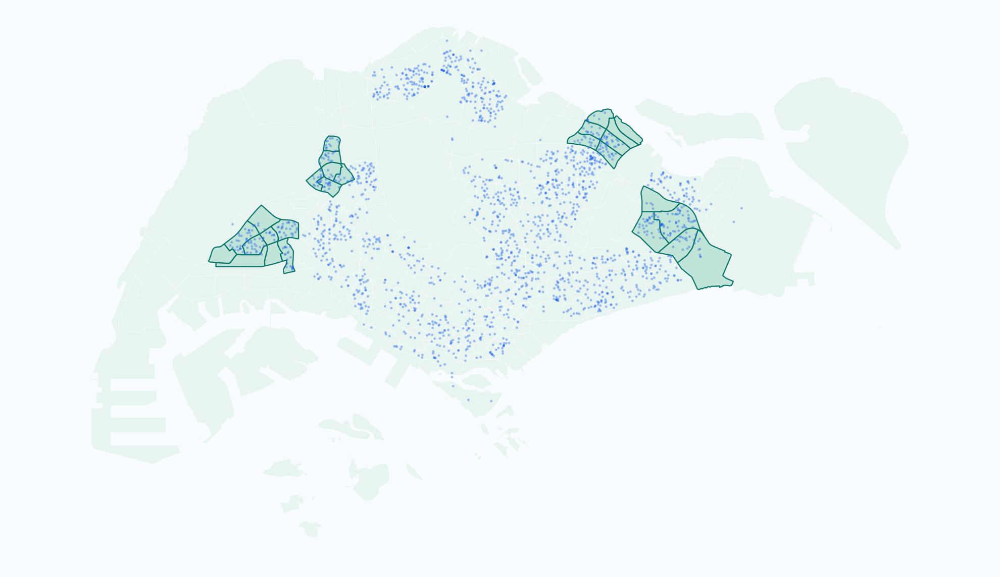

::: {.home-shell}
::: {.home-hero}
::: {.home-copy}
ISSS626 Geospatial Analytics and Applications

# Welcome to My Geospatial Analytics Portfolio

Welcome to my ISSS626 coursework website. I use this portfolio to present my hands-on geospatial analytics work in R, including spatial data preparation, thematic mapping, point density analysis, and spatial interaction diagnostics.

::: {.home-actions}
[Start with Exercise 1](Hands-on_Ex/Hands-on_Ex01/chap01.html){.home-button .primary}
[Point Pattern Analysis](Hands-on_Ex/Hands-on_Ex02/chap04.html){.home-button}
:::
:::

::: {.home-map-card}
{.home-map}

:::
:::

::: {.exercise-grid}
::: {.exercise-card}
Hands-on Exercise 1

## Geospatial Data Science

Import spatial layers, inspect simple feature objects, transform CRS, convert Airbnb listings into points, and run basic geoprocessing.

[Open Chapter 1](Hands-on_Ex/Hands-on_Ex01/chap01.html)
:::

::: {.exercise-card}
Hands-on Exercise 1

## Thematic Mapping

Join population data to subzones, compare choropleth classifications, use facets, and highlight dependency-ratio outliers.

[Open Chapter 2](Hands-on_Ex/Hands-on_Ex01/chap02.html)
:::

::: {.exercise-card}
Hands-on Exercise 2

## Point Density

Prepare childcare centre point patterns, test nearest-neighbour clustering, compare KDE bandwidths, and map density surfaces.

[Open Chapter 4](Hands-on_Ex/Hands-on_Ex02/chap04.html)
:::

::: {.exercise-card}
Hands-on Exercise 2

## Point Interaction

Use G-, F-, K-, and L-functions with CSR simulation envelopes to compare Choa Chu Kang and Tampines.

[Open Chapter 5](Hands-on_Ex/Hands-on_Ex02/chap05.html)
:::
:::
:::
